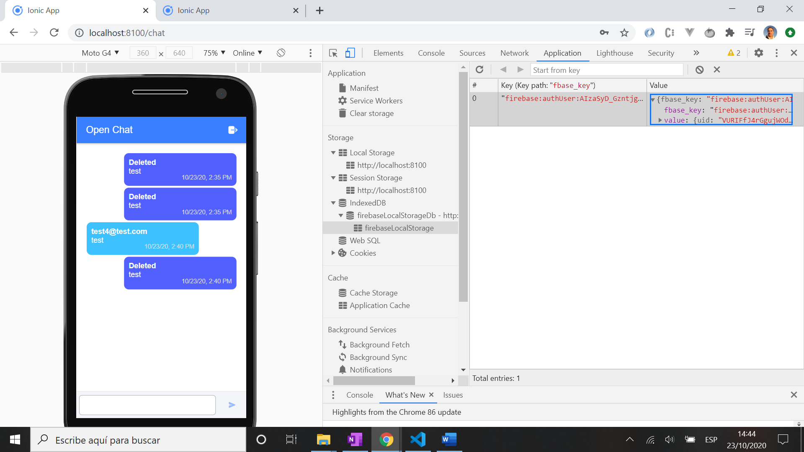

# :zap: Ionic Angular Authentication

* Ionic app to authenticate users so they can access and post messages to a chat board.
* Another great tutorial from [Simon Grimm 'Building an Ionic Firebase Chat with Authentication'](https://www.youtube.com/watch?v=xNleEVG9_yA&t=94s).
* **Note:** to open web links in a new window use: _ctrl+click on link_


## :page_facing_up: Table of contents

* [:zap: Ionic Angular Authentication](#zap-ionic-angular-authentication)
  * [:page_facing_up: Table of contents](#page_facing_up-table-of-contents)
  * [:books: General info](#books-general-info)
  * [:camera: Screenshots](#camera-screenshots)
  * [:signal_strength: Technologies](#signal_strength-technologies)
  * [:floppy_disk: Setup](#floppy_disk-setup)
  * [:computer: Code Examples](#computer-code-examples)
  * [:cool: Features](#cool-features)
  * [:clipboard: Status & To-do list](#clipboard-status--to-do-list)
  * [:clap: Inspiration](#clap-inspiration)
  * [:file_folder: License](#file_folder-license)
  * [:envelope: Contact](#envelope-contact)

## :books: General info

*	Firebase Firestore Authentication used to create sign in and log in functions
* Firebase Cloud Firestore stores users and messages in Collections.
* [Angular FormBuilder](https://angular.io/api/forms/FormBuilder#description) used to reduce the amount of boilerplate needed to build a form
* rxjs map and switchmap operators used

## :camera: Screenshots



## :signal_strength: Technologies

* [Ionic v5](https://ionicframework.com/)
* [Ionic/angular v5](https://ionicframework.com/)
* [Angular v12](https://angular.io/)
* [Firebase v8](https://firebase.google.com/) backend database and authentication APIs

## :floppy_disk: Setup

* Create a Firebase project and add email authentication
* Add Firebase config object to environment variables
* npm i to install dependencies
* Type: 'ionic serve' to start the server on _localhost://8100

## :computer: Code Examples

* extract from `chat.page.html` by [Simon Grimm](https://devdactic.com/) showing ternery expressions to change chat offset and scss class depending on user

```html
	<ion-grid>
    <ion-row *ngFor="let message of messages | async">
      <ion-col size="9" class="message"
        [offset]="message.myMsg ? 3 : 0"
        [ngClass]="{ 'my-message': message.myMsg, 'other-message': !message.myMsg }">
        <b>{{ message.fromName }}</b><br>
        <span>{{ message.msg }}
        </span>
        <div class="time ion-text-right"><br>{{ message.createdAt?.toMillis().toString() | date:'short' }}</div>
      </ion-col>
    </ion-row>
  </ion-grid>
```

## :cool: Features

* Use of ternery expressions to change chat box color and horizontal offset depending on which user chat item is shown

## :clipboard: Status & To-do list

* Status: Complete and working. Problem with dev. console persisting user login id which stops chat from showing user details correctly
* To-do: Find out how to show more than one user email in chat with email username - problem is likely due to storing of user data even after logging out and logging in as a different user.

## :clap: Inspiration

* [Simon Grimm Youtube: 'Building an Ionic Firebase Chat with Authentication'](https://www.youtube.com/watch?v=xNleEVG9_yA&t=94s)
* [Simon Grimm Article: 'Building an Ionic Firebase Chat with Authentication'](https://devdactic.com/ionic-firebase-chat/)

## :file_folder: License

* This project is licensed under the terms of the MIT license.

## :envelope: Contact

* Repo created by [ABateman](https://github.com/AndrewJBateman), email: gomezbateman@yahoo.com
